# CAC Bar Scanner User Manual

The complete guide to installing, configuring, and running CAC Bar
Scanner. Written so that a new bartender or manager can go from an
empty PC to a working kiosk without anyone showing them in person.

> 🔗 **Project home:** <https://github.com/NuclearChickens/CAC-Bar-Scanner>
> &nbsp;·&nbsp; **Direct download:**
> <https://github.com/NuclearChickens/CAC-Bar-Scanner/raw/main/BarScanner.exe>
> &nbsp;·&nbsp; **This manual as a PDF:**
> <https://github.com/NuclearChickens/CAC-Bar-Scanner/raw/main/GUIDE.pdf>

<!-- -->

> [!NOTE]
> This manual describes **version 1.1.0** of CAC Bar Scanner. You can
> check the installed version in Windows under **Settings → Apps →
> Installed apps → CAC Bar Scanner**, or by right-clicking
> `BarScanner.exe` → **Properties → Details**.

---

## How to use this manual

| If you are…                                   | Read…                                                                                   |
| --------------------------------------------- | --------------------------------------------------------------------------------------- |
| **A bartender** who only scans cards          | [Part 4 (Daily use)](#4-daily-use-at-the-bar) and the [Quick reference card](#17-quick-reference-card). |
| **A manager** setting the PC up               | [Part 2 (Install)](#2-installing-on-a-windows-pc) and [Part 3 (First-time setup)](#3-first-time-setup-checklist), then Parts 5 to 12. |
| **Troubleshooting** a problem right now       | [Part 15 (Troubleshooting)](#15-troubleshooting).                                       |
| **Curious how the rules work** under the hood | [Part 13 (How decisions and counting work)](#13-how-decisions-and-counting-work).        |

Throughout the manual, **bold text** is something you see on the
screen (a button, a tab, a message), and `monospace text` is something
you type or a file path.

Screenshots in this manual were captured on a test machine. On Windows
the buttons and tabs are drawn in the Windows style, so they look a
little different, but every control is in the same place with the same
name.

---

## Contents

1. [What the app does](#1-what-the-app-does)
2. [Installing on a Windows PC](#2-installing-on-a-windows-pc)
3. [First-time setup checklist](#3-first-time-setup-checklist)
4. [Daily use at the bar](#4-daily-use-at-the-bar)
5. [Locking and unlocking settings](#5-locking-and-unlocking-settings)
6. [Hours tab](#6-hours-tab)
7. [Limits tab](#7-limits-tab)
8. [Roster tab](#8-roster-tab)
9. [Banned tab](#9-banned-tab)
10. [Reset tab](#10-reset-tab)
11. [Logs tab](#11-logs-tab)
12. [Backup tab](#12-backup-tab)
13. [How decisions and counting work](#13-how-decisions-and-counting-work)
14. [Where data is stored and privacy](#14-where-data-is-stored-and-privacy)
15. [Troubleshooting](#15-troubleshooting)
16. [Keyboard shortcuts](#16-keyboard-shortcuts)
17. [Quick reference card](#17-quick-reference-card)
18. [Glossary](#18-glossary)

---

## 1. What the app does

CAC Bar Scanner turns a Windows PC and a USB barcode scanner into a
drink-counting kiosk for a bar that serves military ID holders.

1. A customer presents their **CAC** (Common Access Card).
2. The bartender scans the **barcode on the front of the card**.
3. In under a second the screen turns **green (ALLOWED)** or **red
   (DENIED)**, a bell or buzzer sounds, and the screen shows how many
   drinks that person has had.
4. Allowed drinks are counted per person. Once someone reaches the
   limit, further scans are denied until the counting period rolls
   over or an admin resets the counts.

Everything the app decides is based on rules a manager sets once:

| Rule       | Set on the… | What it controls                                                           |
| ---------- | ----------- | -------------------------------------------------------------------------- |
| **Hours**  | Hours tab   | When the bar is "open" for counting, and when counts start over.          |
| **Limit**  | Limits tab  | Maximum drinks per person per counting period (default **3**).             |
| **Roster** | Roster tab  | Which personnel categories and service branches are allowed to be served. |
| **Bans**   | Banned tab  | Specific DoD ID numbers that are always denied, permanently or until a date. |

### What you need

- A PC running **Windows 10 or 11**. (The app also runs from source on
  Linux and macOS for testing, but the kiosk install is Windows-only.)
- A **USB barcode scanner** that can read **Code 39** barcodes and
  works as a keyboard (sometimes called "keyboard wedge" or "HID
  mode"). Almost every handheld USB scanner does this out of the box,
  whether it is a 1D-only model or a 2D model that also reads QR codes.
- **Speakers** are optional. Without them the app is simply silent.
- **Administrator rights on the PC, once**, to install. Day-to-day use
  needs no special rights.

### What the app does not do

- It **never connects to the internet** or to any server. Everything
  stays on the PC.
- It stores **no names**. The only personal data it keeps is the
  10-digit DoD ID number from the card, plus the category and branch
  letters: in the drink counts for the current period, and in the
  daily scan logs (see [Section 11.3](#113-daily-scan-logs) and
  [Part 14](#14-where-data-is-stored-and-privacy)).
- It does **not** verify that a card is genuine, check age, or check
  whether the card has expired. It reads the barcode and applies the
  rules above. It is a drink-count and eligibility tool, not an ID
  checker.

### The barcode it reads

The front of a CAC has two barcodes. The app reads the **linear
(1D) barcode**, the plain stripe of thin and thick lines. It does not
use the square, dense 2D barcode.

That stripe encodes an **18-character** code. From it the app works
out three things:

| Field        | What it is                                                                   |
| ------------ | ---------------------------------------------------------------------------- |
| **EDIPI**    | The cardholder's 10-digit DoD ID number. This is how the app tells people apart. |
| **Category** | A single letter for the personnel category, e.g. **A** = Active duty member. |
| **Branch**   | A single letter for the service, e.g. **N** = USN (Navy).                    |

The full category and branch tables are in [Part 8](#8-roster-tab).

---

## 2. Installing on a Windows PC

You do this once per PC. Allow about five minutes.

### 2.1 Before you start

- Log in to Windows with an account that has **administrator rights**,
  or have someone who does standing by. Windows will ask for permission
  once during install.
- Plug in the USB barcode scanner. Windows treats it as a keyboard; no
  driver is needed.
- If the PC has speakers, turn them on and check the Windows volume.

### 2.2 Download the app

1. Open the project home page:
   <https://github.com/NuclearChickens/CAC-Bar-Scanner>
2. Click the **⬇ Download BarScanner.exe** button near the top of the
   page. Your browser saves the file to your **Downloads** folder.
   The file is about 11 MB.

The direct link, if you prefer to type it, is
<https://github.com/NuclearChickens/CAC-Bar-Scanner/raw/main/BarScanner.exe>.

### 2.3 First launch and the Windows warning

1. Open **File Explorer → Downloads** and double-click `BarScanner.exe`.
2. Windows may show a blue box titled **"Windows protected your PC"**.
   This appears because the app is not code-signed by a commercial
   certificate, not because anything is wrong with it.
3. Click **More info**, then **Run anyway**. Windows remembers this
   choice for this file.

The app opens maximized with the title **CAC Barcode Scanner**.

### 2.4 The Install prompt

On the very first launch, a small dialog appears over the main window:

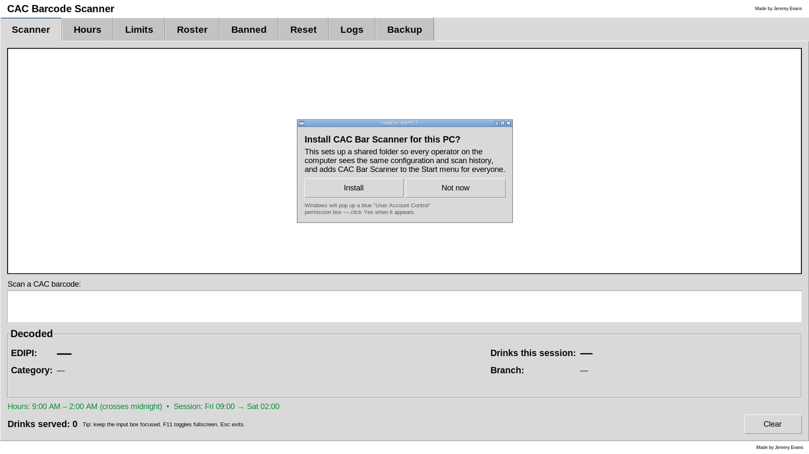

1. Click **Install**.
2. Windows shows a blue **User Account Control** box asking whether to
   allow the app to make changes. Click **Yes**.
3. A few seconds later the footer of the main window says
   **Installed for everyone on this PC.**

That is the whole install. You can now close the app and delete the
copy in Downloads if you like; the Start menu uses its own copy.

### 2.5 What Install does

| Step                          | Where                                                         | Why                                                                  |
| ----------------------------- | ------------------------------------------------------------- | -------------------------------------------------------------------- |
| Copies the program            | `C:\Program Files\CAC Bar Scanner\BarScanner.exe`             | So the app has a permanent home that does not depend on Downloads.   |
| Creates the shared data folder| `C:\ProgramData\CACBarScanner\`                               | Every Windows user on the PC shares one set of settings and counts.  |
| Adds a Start menu shortcut    | Start menu → **CAC Bar Scanner** (visible to every user)      | So staff can launch it by pressing the Windows key and typing "Bar". |
| Registers in Apps & Features  | **Settings → Apps → Installed apps**                          | So it can be uninstalled cleanly later, with version and publisher shown. |

> [!IMPORTANT]
> The data folder is shared by **every Windows account** on the PC.
> If bartenders log in with different Windows accounts, they still see
> the same settings, the same bans, and the same drink counts.

### 2.6 If you click Not now

The app still runs, but only from the file you double-clicked. There
is no Start menu entry, and the data folder is created without the
shared permissions, so **other Windows accounts** on the PC may be
unable to save settings or record scans.

The prompt will not come back for the same Windows account, but it
does appear for any *other* account that launches the app. As soon as
anyone clicks **Install**, the prompt is retired for everyone.

You can install at any later time from inside the app (next section).

### 2.7 Reinstall or repair from inside the app

If the install prompt was dismissed, or the app is installed but the
Start menu entry has vanished, use the **PC install** box on the
**Backup** tab.

1. Open the **Backup** tab. The **PC install** box at the top reports
   one of three states:
    - **Not installed for this PC.** Click **Install for this PC…**
    - **Installed for this PC.** Click **Reinstall…** to refresh the
      shortcut, the data-folder permissions, and the Apps & Features
      entry. Reinstalling never touches your settings or logs.
    - **Registered as installed, but the Start menu shortcut is
      missing.** Click **Reinstall…** to recreate the shortcut.
2. Approve the **User Account Control** prompt.
3. Click **Open Start menu folder** to see the shortcut in
   `C:\ProgramData\Microsoft\Windows\Start Menu\Programs\`. Windows
   Search sometimes takes a minute to notice new shortcuts. If the file
   is there but typing "Bar" finds nothing, wait a moment and try again.

The **PC install** box only appears in the Windows program. It is
hidden when the app is run from source on another operating system.

### 2.8 If the install fails

The step that runs with administrator rights shows its own popup
titled **Install failed** naming exactly which sub-step went wrong:

- Copy BarScanner.exe to Program Files
- Provision shared data folder
- Create Start menu shortcut
- Register in Add/Remove Programs

Write down or photograph the message. The usual fixes are:

1. Right-click `BarScanner.exe` and choose **Run as administrator**,
   then click **Install** again.
2. Check that the PC is not locked down by a policy that blocks
   PowerShell. The shortcut is created through PowerShell.
3. If you clicked **No** on the User Account Control box, the footer
   says **Cancelled — no changes were made.** Just try again and click
   **Yes**.

### 2.9 Updating to a new version

Your settings, bans, and logs live in the data folder, and updating
never touches that folder.

1. Download the new `BarScanner.exe` from the project page.
2. Double-click the **new** file in Downloads. Because the app is
   already installed, the install prompt does not appear.
3. Open the **Backup** tab and click **Reinstall…**, then approve the
   User Account Control prompt. This copies the new version into
   `C:\Program Files\CAC Bar Scanner\`.
4. Close the app and relaunch it from the Start menu. Check the version
   under **Settings → Apps → Installed apps** if you want to be sure.

### 2.10 Uninstalling

Start from either place:

- **Settings → Apps → Installed apps**, find **CAC Bar Scanner**, click
  the **⋯** menu → **Uninstall**.
- Or in the **Start menu**, right-click **CAC Bar Scanner** →
  **Uninstall**.

Windows then runs the app in uninstall mode and a small dialog appears:

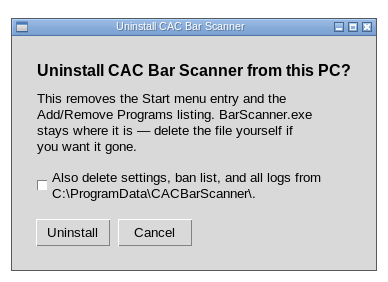

1. Decide what to do with your data. The checkbox **Also delete
   settings, ban list, and all logs** is off by default.
    - **Leave it unchecked** to keep the data folder. A later reinstall
      picks up exactly where you left off.
    - **Tick it** for a complete wipe, including the audit history.
2. Click **Uninstall**.
3. Approve the **User Account Control** prompt.

The Start menu entry and the Apps & Features listing disappear
immediately. The copy in `C:\Program Files\CAC Bar Scanner\` is removed
on the next reboot, which is normal for Windows uninstallers. Any copy
still sitting in Downloads is not touched.

> [!NOTE]
> The **Uninstall…** button on the Backup tab does something smaller:
> it removes only the Start menu shortcut and the Apps & Features
> entry, and always keeps your data. Use the Windows Settings route for
> a full uninstall.

---

## 3. First-time setup checklist

Do this once after installing, before the first night of service.
Every step is explained in detail later in the manual.

1. **Launch the app.** Press the Windows key, type `Bar`, press Enter.
2. **Unlock the settings.** Open the **Hours** tab and click **Unlock**
   on the pink banner. The default password is `admin`.
   → [Part 5](#5-locking-and-unlocking-settings)
3. **Set a new admin password** right away on the **Reset** tab.
   Write it somewhere safe; recovering a lost password needs
   administrator access to the PC.
   → [Section 10.1](#101-setting-the-admin-password)
4. **Set the hours.** On the **Hours** tab pick a counting mode and
   enter your opening and closing times. Do this *before* opening,
   because changing hours during service can discard counts.
   → [Part 6](#6-hours-tab)
5. **Set the drink limit** on the **Limits** tab (default 3).
   → [Part 7](#7-limits-tab)
6. **Choose who can be served** on the **Roster** tab. By default
   everyone is allowed.
   → [Part 8](#8-roster-tab)
7. **Add any bans** on the **Banned** tab.
   → [Part 9](#9-banned-tab)
8. **Lock the settings** by clicking **Lock** on any green banner.
9. **Test a scan.** Go to the **Scanner** tab and scan a real CAC. You
   should see a green **ALLOWED — 1st drink** banner and hear a bell.
   Scan it again until it turns red to confirm the limit works, then
   reset the counts on the **Reset** tab.
   → [Part 4](#4-daily-use-at-the-bar)
10. **Export a baseline backup** from the **Backup** tab and keep the
    `.zip` somewhere off the PC.
    → [Section 12.3](#123-exporting-a-backup)
11. **Check the PC clock.** Every count and log entry uses the PC's
    clock. Make sure the time zone and time are correct in Windows.

---

## 4. Daily use at the bar

This part is for whoever is behind the bar. It covers only the
**Scanner** tab. You do not need the admin password for anything here.

### 4.1 Starting the app

1. Tap the **Windows key**.
2. Type `Bar`.
3. Press **Enter** when **CAC Bar Scanner** is highlighted.

The window opens maximized. Press **F11** to make it fill the whole
screen with no title bar (kiosk mode). Press **Esc** or **F11** again
to go back.

If the app is already running, click it on the taskbar instead of
opening a second copy.

### 4.2 The Scanner screen, piece by piece

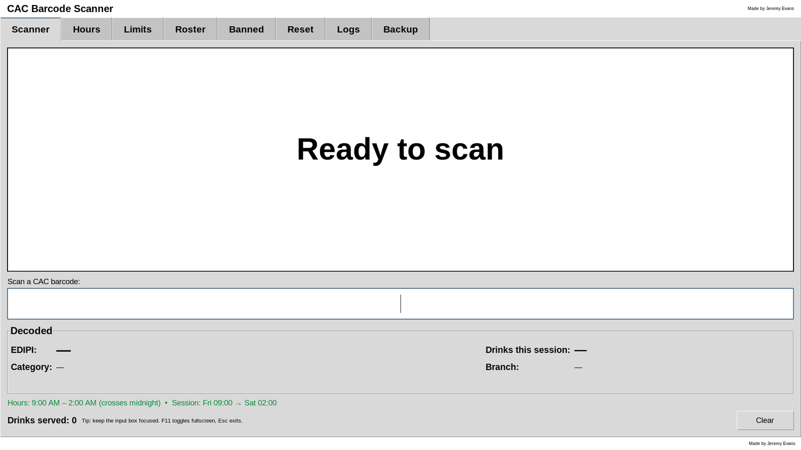

From top to bottom:

| Area                        | What it shows                                                                                                  |
| --------------------------- | -------------------------------------------------------------------------------------------------------------- |
| **Header**                  | The app name. Nothing to click.                                                                                |
| **Tabs**                    | **Scanner** (this screen) plus the admin tabs: Hours, Limits, Roster, Banned, Reset, Logs, Backup.             |
| **Verdict banner**          | The big box. Says **Ready to scan** until a card is scanned, then turns green or red with the result.         |
| **Scan a CAC barcode** box  | The input box. The cursor lives here. The scanner "types" the barcode into it.                                  |
| **Decoded** box             | Details from the last card: EDIPI, drinks so far, category, branch.                                            |
| **Session line**            | The current hours and counting period, in green when open and red when closed.                                 |
| **Drinks served**           | Running total of every allowed drink in the current period, for the whole bar.                                 |
| **Tip line**                | A reminder of the keyboard shortcuts.                                                                          |
| **Clear** button            | Blanks the banner and the Decoded box.                                                                         |
| **Status bar** (very bottom)| Short confirmations and error messages. Green messages fade after two seconds; red ones stay until the next action. |

### 4.3 Scanning a card

1. Make sure the **Scanner** tab is showing.
2. Point the scanner at the **linear barcode** on the front of the CAC
   and pull the trigger (or hold the card under a hands-free scanner).
3. The 18-character code types itself into the input box and the
   verdict appears immediately. You do not need to press anything.

The input box empties itself after every scan, ready for the next
card.

> [!TIP]
> The app fires as soon as 18 characters arrive. If the scanner sends
> an Enter keystroke afterwards, that is fine and is ignored. You can
> also type a code by hand and press **Enter** to test.

### 4.4 The three verdicts

| Banner                | Sound      | Meaning                                                                   | Counted? |
| --------------------- | ---------- | ------------------------------------------------------------------------- | -------- |
| 🟢 **ALLOWED**        | 🔔 Bell    | Serve the drink. The banner shows which drink number this is.             | Yes      |
| 🔴 **DENIED**         | 📢 Buzzer  | Do not serve. The banner gives the reason in plain English.               | No       |
| 🔴 **INVALID SCAN**   | 📢 Buzzer  | The scanner did not read a valid CAC barcode. Usually a bad swipe.        | No       |

Denied scans are **never counted** toward the limit, so a person
cannot use up their limit by being denied, and invalid scans are not
counted at all. All three verdicts are still written to that day's
**scan log**, so there is always a record of what was scanned (see
[Section 11.3](#113-daily-scan-logs)).

### 4.5 Reading a green ALLOWED banner

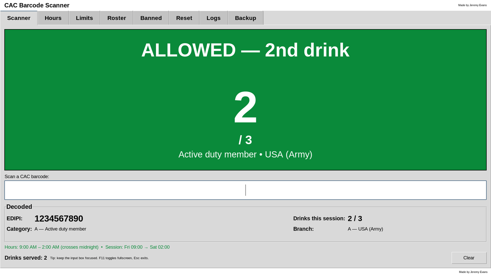

- **Headline:** **ALLOWED — 2nd drink** (1st, 2nd, 3rd…). This is the
  drink you are about to serve, counting the one just scanned.
- **Giant number:** the same count, big enough to read from across the
  bar, over a smaller **/ 3** showing the limit.
- **Detail line:** the cardholder's category and branch, for example
  **Active duty member • USA (Army)**.

The bell has already rung by the time you see green, and the drink is
already recorded. If the PC lost power a moment later, the count would
still be there.

### 4.6 Reading a red DENIED banner

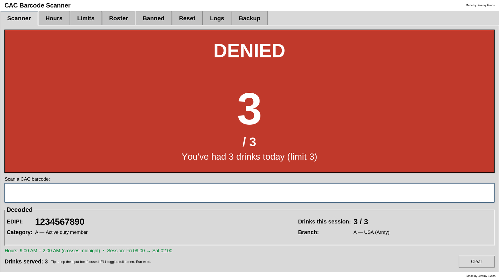

The headline is **DENIED**, the giant number shows how many drinks the
person has already had this period, and the detail line says why.
Reasons, in the order the app checks them:

| Detail line on screen                                  | What it means                                                                 | What to do                                                                        |
| ------------------------------------------------------ | ----------------------------------------------------------------------------- | --------------------------------------------------------------------------------- |
| **This DoD ID is permanently banned**                  | The ID is on the Banned tab with no end date.                                 | Do not serve. Only an admin can lift the ban.                                     |
| **This DoD ID is banned until 2026-12-31**             | The ID is on the Banned tab with an end date; the ban is still active.        | Do not serve. The ban lifts by itself the day after the date shown.               |
| **Bar is closed (outside operating hours)**            | The PC clock is outside the hours set on the Hours tab.                       | Do not serve. If the bar really is open, an admin needs to fix the Hours tab.     |
| **Active duty member (A) not allowed**                 | That personnel category is unchecked on the Roster tab.                        | Do not serve unless an admin changes the roster.                                  |
| **USN (Navy) (N) not allowed**                         | That service branch is unchecked on the Roster tab.                            | Do not serve unless an admin changes the roster.                                  |
| **You've had 3 drinks today (limit 3)**                | The person has reached the drink limit for this period.                        | Do not serve. Counts start over when the period rolls over or an admin resets.    |

Only the **first** matching reason is shown. A banned person is always
reported as banned, even if the bar is also closed.

### 4.7 INVALID SCAN

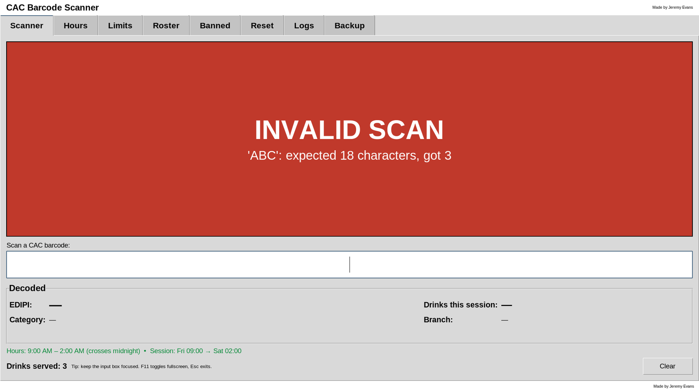

The detail line shows what was received and what was wrong, for
example **'ABC': expected 18 characters, got 3**. Nothing is recorded
and the Decoded box is cleared.

Common causes:

- The card moved during the scan. **Scan again.**
- The scanner read the **2D barcode** or the barcode on the **back** of
  the card. Aim at the linear stripe on the front.
- Something other than a CAC was scanned.
- Someone typed in the input box. Click **Clear** and scan again.

If *every* card comes up invalid, see
[Part 15](#15-troubleshooting).

### 4.8 The Decoded box

After any successful read (allowed or denied) the box shows:

| Field                    | Example                    | Notes                                                                                     |
| ------------------------ | -------------------------- | ----------------------------------------------------------------------------------------- |
| **EDIPI**                | `1234567890`               | The 10-digit DoD ID. This is the number an admin needs to add a ban.                      |
| **Drinks this session**  | `2 / 3`                    | Drinks so far in this period, over the limit. In rolling-window mode the label reads **Drinks (last 24h)**. |
| **Category**             | `A — Active duty member`   | Category letter and meaning.                                                              |
| **Branch**               | `A — USA (Army)`           | Branch letter and meaning.                                                                |

Before any scan, and after **Clear**, every field shows a dash.

### 4.9 The session line

This line tells you which rules are in force right now. Examples:

| You see                                                                              | Meaning                                                                                |
| ------------------------------------------------------------------------------------ | -------------------------------------------------------------------------------------- |
| 🟢 **Hours: 5:00 PM – 2:00 AM (crosses midnight) • Session: Fri 17:00 → Sat 02:00**   | Operating-hours mode. The bar is open; counts started at Friday 17:00.                 |
| 🟢 **Hours: 24 h, day starts at 12:00 AM • Session: Fri 00:00 → Sat 00:00**           | Operating-hours mode set to 24 hours. Counts start over at midnight.                   |
| 🔴 **Hours: 5:00 PM – 2:00 AM (crosses midnight) • CLOSED right now**                 | Operating-hours mode, outside the hours. Every scan will be denied as "Bar is closed". |
| 🟢 **Rolling 24-hour window • counting since Thu 18:32**                              | Rolling-window mode. Each person's drinks in the last 24 hours are counted.            |
| 🟢 **… • reset at Fri 20:15**                                                          | Added to either mode after an admin reset. Only drinks after that time count.          |

The line refreshes once a minute, and immediately after any settings
change.

### 4.10 Drinks served

Bottom-left, **Drinks served: 12** is the total number of allowed
drinks across every customer in the current period. It goes up by one
on each green scan, and starts over when the period rolls over or an
admin resets. When the bar is closed it reads **Drinks served: 0 •
closed**. In rolling mode it reads **Drinks served (last 24h): 12**.

### 4.11 The Clear button

Blanks the verdict banner back to **Ready to scan** and clears the
Decoded box. It does **not** undo a drink or change any count. Use it
if you want a clean screen between customers or to hide the last
person's ID.

### 4.12 Keeping the cursor in the input box

The scanner types wherever the keyboard cursor is. The app keeps the
cursor parked in the input box, and if someone clicks elsewhere on the
Scanner tab (the banner, the Decoded box, empty space) the cursor jumps
straight back. Switching to another tab and back also returns it.

If a scan ever seems to do nothing, click once anywhere on the Scanner
tab and scan again.

### 4.13 Sounds

Every scan makes a sound so you can keep your eyes on the customer:

- **ALLOWED:** a short, high bell.
- **DENIED or INVALID:** a low, flat buzzer.

The two are deliberately opposite so they cannot be confused across a
loud room. A new scan cuts off the previous sound, so rapid scanning
never piles up.

Volume is whatever Windows is set to; use the speaker icon in the
system tray. There is no in-app volume control or mute. A PC with no
speakers or no sound card runs normally and just stays silent.

### 4.14 Shift change and end of night

Normally there is nothing to do. In operating-hours mode, counts start
over automatically at the next opening time. In rolling-window mode,
each person's old drinks stop counting as they age out of the window.

If a manager wants everyone's count back to zero right now (for
example, a special event with its own limit), they use **Reset drinks
for the day** on the Reset tab, which needs the admin password.

### 4.15 Closing the app

Press **Ctrl + Q**, or leave fullscreen with **Esc** and click the
window's close button. Nothing is lost: counts, settings, and logs are
already saved. Relaunch from the Start menu whenever needed.

---

## 5. Locking and unlocking settings

For everyday scanning, the Scanner tab is always available. Anything
that changes the rules sits behind the **admin password**.

### 5.1 What is locked

| Locked (needs the password)                                | Always available                            |
| ---------------------------------------------------------- | ------------------------------------------- |
| **Hours** tab                                              | **Scanner** tab                             |
| **Limits** tab                                             | **Logs** tab (read-only)                    |
| **Roster** tab                                             | **Backup → Export full backup…**            |
| **Banned** tab                                             | **Backup → PC install** box                 |
| **Reset** tab (password change and drink reset)            |                                             |
| **Backup → Import full backup…**                           |                                             |

### 5.2 The lock banner

Each locked tab has a coloured banner across the top:

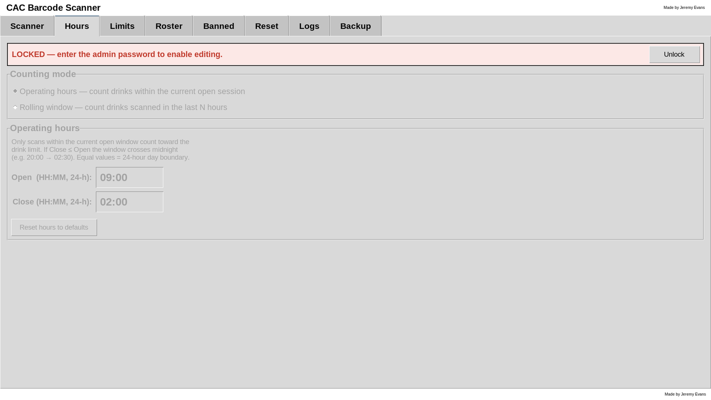

- **Pink, "LOCKED — enter the admin password to enable editing."**
  Every control below it is greyed out. Click **Unlock** to open the
  password prompt.
- **Green, "UNLOCKED — auto-locks 5 minutes after unlock."** Controls
  are live. Click **Lock** to lock immediately.

All the locked tabs share **one** lock. Unlocking on the Hours tab
unlocks Limits, Roster, Banned, Reset, and Import at the same time.

### 5.3 Unlocking

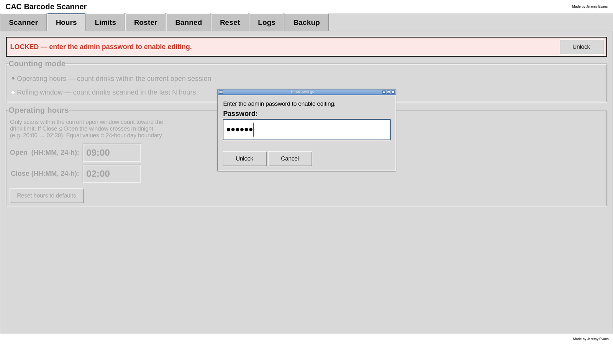

1. Click **Unlock** on any pink banner.
2. In the **Unlock settings** popup, type the admin password. It shows
   as dots.
3. Press **Enter** or click **Unlock**.

If the password is wrong the popup says **Incorrect password.** and
clears the box so you can try again. Click **Cancel** to give up.

On success every banner turns green and the status bar says
**Settings unlocked. Auto-locks in 5 minutes.**

> [!NOTE]
> The very first password is `admin`. Change it before the first night
> of service. See [Section 10.1](#101-setting-the-admin-password).

### 5.4 The five-minute timer

The timer starts when you unlock and is **not** extended by typing or
clicking. Five minutes after the unlock, the app locks itself and the
status bar says **Settings auto-locked after 5 minutes of being
unlocked.** Nothing is lost: every change you made was saved the moment
you made it. Just unlock again if you need more time.

### 5.5 Locking

Click **Lock** on any green banner, or wait for the timer. Closing the
app also locks. Locking writes a summary of what you changed to the
Logs tab (see [Part 11](#11-logs-tab)).

### 5.6 How changes are saved

There is no Save button on the settings tabs. Each change is written to
disk the moment you make it, and the status bar flashes **Saved.** If a
change is not valid (for example a badly formed time), the status bar
shows a red message and that particular change is not saved until you
fix it.

### 5.7 Recovering a lost password

If nobody knows the admin password, someone with **administrator
rights on the Windows PC** can reset it to `admin`:

1. Close CAC Bar Scanner.
2. Open Notepad **as administrator** (right-click Notepad → **Run as
   administrator**).
3. In Notepad choose **File → Open** and open
   `C:\ProgramData\CACBarScanner\settings.json`. If the file list
   looks empty, change the file-type box from "Text Documents" to
   "All Files".
4. Find the line that starts with `"admin_password_hash":`. Delete
   everything between the second pair of quotes so the line reads:

        "admin_password_hash": ""

    Change nothing else. Keep any comma or bracket that follows on the
    line exactly as it was.

5. Save the file and relaunch the app. The password `admin` works
   again. Set a new one immediately.

> [!WARNING]
> If the file is damaged by a typo, the app silently falls back to
> default settings and your hours, roster, and bans are lost the next
> time anything is saved. Export a backup from the Backup tab first
> (no password needed) so you can restore it if that happens.

(On Linux or macOS, the file is in `~/.cac_scanner/` instead.)

---

## 6. Hours tab

The Hours tab decides **when** drinks are counted and **when counts
start over**. Unlock the settings before editing.

### 6.1 Choosing a counting mode

At the top, under **Counting mode**, pick one of two radio buttons.
Only the settings for the chosen mode are shown; the other mode's
settings are hidden so they cannot be edited by accident.

| Mode                                                                    | Best for                                                                             |
| ----------------------------------------------------------------------- | ------------------------------------------------------------------------------------ |
| **Operating hours — count drinks within the current open session**      | A bar with fixed opening and closing times. Counts reset at each opening. (Default.)|
| **Rolling window — count drinks scanned in the last N hours**           | A venue that is effectively always open, or where you want a "per 24 hours" rule regardless of clock time. |

### 6.2 Operating-hours mode

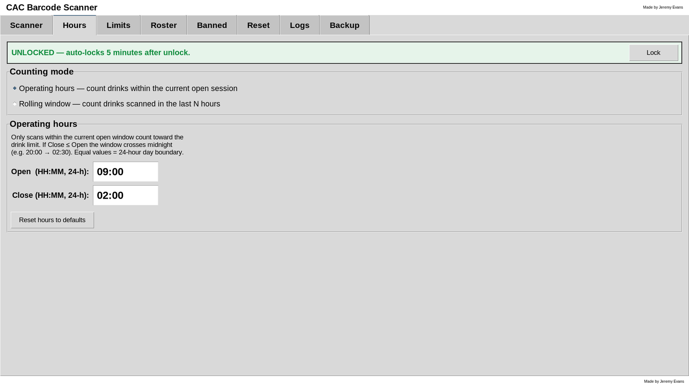

Two fields, both in 24-hour **HH:MM** form:

- **Open (HH:MM, 24-h):** when counting starts each day.
- **Close (HH:MM, 24-h):** when the bar is considered closed.

Between Open and Close the bar is **open**: scans are allowed (subject
to the other rules) and each person's drinks are counted from the Open
time. Outside those hours every scan is denied with **Bar is closed
(outside operating hours)**.

How the two times combine:

| Open    | Close   | Result                                                                                                  |
| ------- | ------- | ------------------------------------------------------------------------------------------------------- |
| `17:00` | `23:00` | Open 5 PM to 11 PM the same day. Closed the rest of the time.                                            |
| `20:00` | `02:30` | Close is *earlier* than Open, so the session **crosses midnight**: 8 PM tonight to 2:30 AM tomorrow.     |
| `00:00` | `00:00` | Open and Close are equal, so the bar is **open 24 hours** and counts start over every day at midnight.   |
| `06:00` | `06:00` | Also 24 hours, but the "day" starts over at 6 AM. Useful if the bar routinely runs past midnight.        |

Typing tips:

- You can type `9:30` or `09:30`. Seconds are not used.
- While you are half-way through typing (for example you have typed
  `1` of `17:00`) the status bar briefly shows a red **Invalid time**
  message. That is normal; it turns to **Saved.** once the time is
  complete.
- Hours are always the PC's local time. Check the Windows clock.

**Reset hours to defaults** puts both fields back to `00:00`, which is
the 24-hour setting.

> [!WARNING]
> **Set the hours before service, not during.** The app keeps only the
> drink records that fall inside the current session. If you change the
> Open time to *after* some drinks were served, those drinks fall out
> of the session and are discarded. And while the bar is closed, all
> records from the last session are deleted within a minute, so counts
> never carry over from one session to the next.

### 6.3 Rolling-window mode

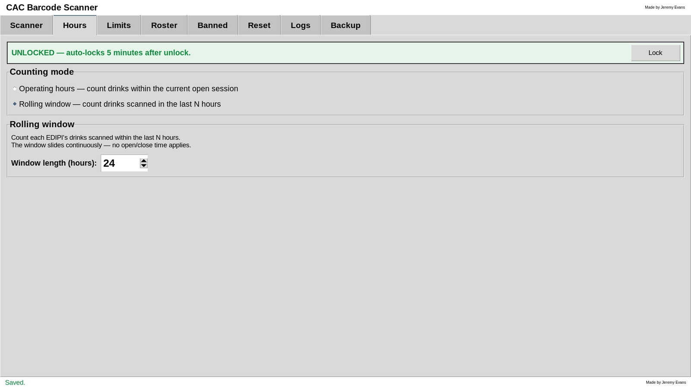

One field: **Window length (hours):** from **1** to **168** (one week).
The default is **24**.

Each person's count is the number of drinks they were served in the
last N hours, measured from the moment of the scan. The window slides
continuously. There is no open or close time, so the bar is never
"closed" and the **Bar is closed** denial never appears in this mode.

Example with a 24-hour window and a limit of 3: someone served at 8 PM,
9 PM, and 10 PM on Friday is denied until just after 8 PM Saturday,
when the first drink is more than 24 hours old and they are allowed
one more.

The Scanner tab reflects the mode: the Decoded box label becomes
**Drinks (last 24h)** and the bottom-left counter becomes **Drinks
served (last 24h)**.

### 6.4 Which mode should I pick

- Choose **Operating hours** if you want a clean "everyone starts at
  zero when we open" rule and a hard stop outside opening times.
- Choose **Rolling window** if the venue is open around the clock, or
  if you want "no more than N drinks in any 24-hour span" regardless
  of when they were served.

Switching modes takes effect immediately and is recorded in the Logs
tab as **tracking_mode: hours → rolling** (or the reverse).

---

## 7. Limits tab

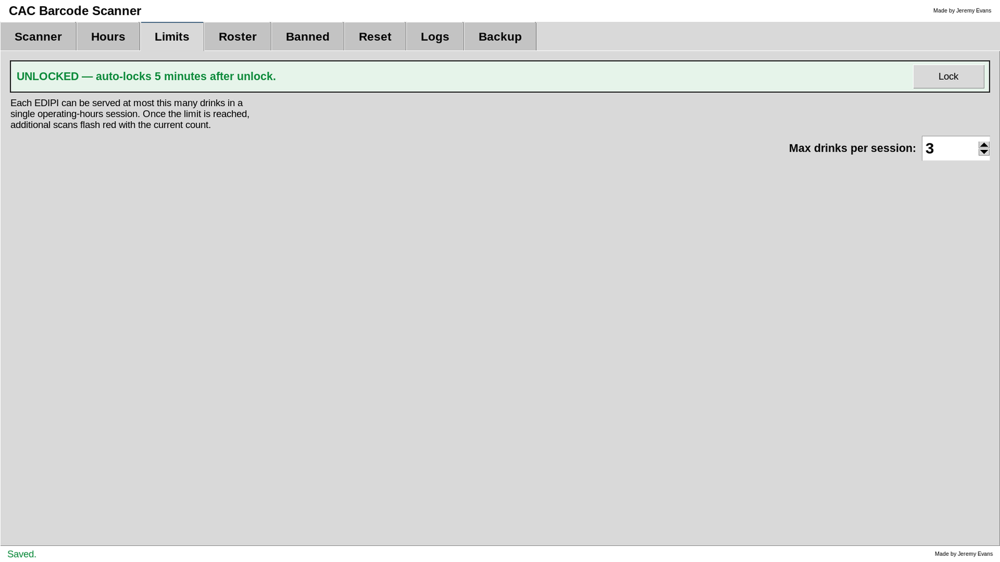

One setting: **Max drinks per session**, from **1** to **99**. The
default is **3**. Use the arrows or type a number.

Once a person reaches the limit, every further scan turns red with
**You've had 3 drinks today (limit 3)**, showing their count and the
limit, until:

- the next opening time arrives (operating-hours mode), or
- their earlier drinks slide out of the window (rolling-window mode),
  or
- an admin uses **Reset drinks for the day** on the Reset tab.

Lowering the limit applies at once, including to people who have
already passed the new number. Raising it lets them continue.

The change is logged as **max_drinks: 3 → 5**.

---

## 8. Roster tab

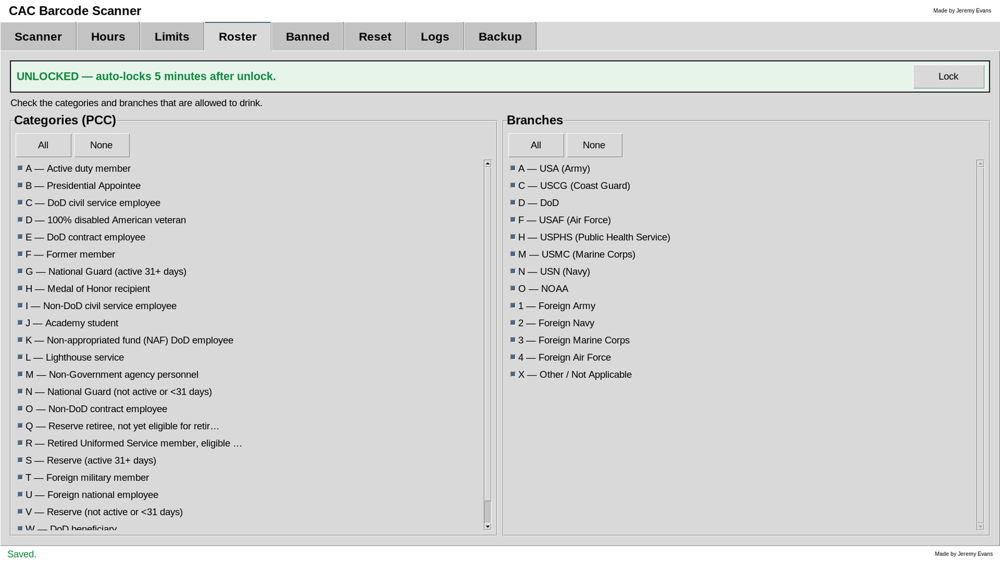

Two side-by-side checklists decide which kinds of cardholders may be
served. A scan is allowed only if **both** the person's category **and**
their branch are ticked. By default everything is ticked.

- **Categories (PCC)** on the left, one box per personnel category
  letter.
- **Branches** on the right, one box per service.
- Each list has **All** and **None** buttons that tick or untick every
  box in that list at once. A quick way to allow only a few groups is
  **None**, then tick the ones you want.
- Long lists scroll with the mouse wheel or the scrollbar.

Each change saves instantly and is logged as, for example, **category
disabled: E, O** or **branch enabled: C**.

### 8.1 Personnel categories

| Code | Category                                                   |
| ---- | ---------------------------------------------------------- |
| A    | Active duty member                                         |
| B    | Presidential Appointee                                     |
| C    | DoD civil service employee                                 |
| D    | 100% disabled American veteran                             |
| E    | DoD contract employee                                      |
| F    | Former member                                              |
| G    | National Guard (active 31+ days)                           |
| H    | Medal of Honor recipient                                   |
| I    | Non-DoD civil service employee                             |
| J    | Academy student                                            |
| K    | Non-appropriated fund (NAF) DoD employee                   |
| L    | Lighthouse service                                         |
| M    | Non-Government agency personnel                            |
| N    | National Guard (not active or under 31 days)               |
| O    | Non-DoD contract employee                                  |
| Q    | Reserve retiree, not yet eligible for retired pay          |
| R    | Retired Uniformed Service member, eligible for retired pay |
| S    | Reserve (active 31+ days)                                  |
| T    | Foreign military member                                    |
| U    | Foreign national employee                                  |
| V    | Reserve (not active or under 31 days)                      |
| W    | DoD beneficiary                                            |
| Y    | Retired DoD Civil Service Employee                         |

### 8.2 Branches

| Code | Branch                            |
| ---- | --------------------------------- |
| A    | USA (Army)                        |
| C    | USCG (Coast Guard)                |
| D    | DoD                               |
| F    | USAF (Air Force)                  |
| H    | USPHS (Public Health Service)     |
| M    | USMC (Marine Corps)               |
| N    | USN (Navy)                        |
| O    | NOAA                              |
| 1    | Foreign Army                      |
| 2    | Foreign Navy                      |
| 3    | Foreign Marine Corps              |
| 4    | Foreign Air Force                 |
| X    | Other / Not Applicable            |

> [!NOTE]
> These tables come from the DoD barcode standard the cards follow. A
> card with a category or branch letter that is not in them shows as
> **Unknown** in the Decoded box and is always denied with
> **Unknown (…) not allowed**, because an unknown letter can never be
> ticked on the roster.

---

## 9. Banned tab

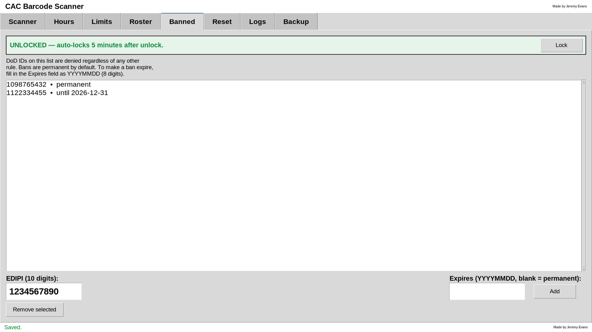

The ban list denies specific people regardless of every other rule. A
banned person is denied even when the bar is closed, even if their
category and branch are allowed, and even if they have had no drinks.

### 9.1 Adding a ban

1. Find the person's 10-digit **EDIPI**. The easiest way is to scan
   their card on the Scanner tab and read it from the **Decoded** box.
   It is also printed on the back of the card as the DoD ID number.
2. Unlock the settings and open the **Banned** tab.
3. Type the number in **EDIPI (10 digits)**.
4. To make the ban temporary, type an end date in **Expires (YYYYMMDD,
   blank = permanent)** as eight digits, for example `20261231` for
   31 December 2026. (`2026-12-31` with dashes is also accepted.)
   Leave it blank for a permanent ban.
5. Click **Add** or press **Enter** in either field.

The new entry appears in the list as **1234567890 • permanent** or
**1234567890 • until 2026-12-31**, and both fields clear for the next
entry.

If something is wrong the status bar shows a red message and nothing
is added:

| Message                                             | Fix                                                     |
| --------------------------------------------------- | ------------------------------------------------------- |
| **EDIPI must be exactly 10 digits**                 | Check for typos, spaces, or a missing digit.            |
| **1234567890 is already banned**                    | The number is already in the list. Remove it first to change its date. |
| **Expires must be 8 digits (YYYYMMDD) or blank**    | Use the year-month-day order with no other characters.  |
| **Invalid date: …**                                 | The date does not exist, e.g. month 13 or 31 February.  |

### 9.2 How expiry works

A ban with a date is active **through the end of that day**. Someone
banned until `2026-12-31` is denied all day on 31 December and allowed
again on 1 January. Nothing needs to be done when a ban expires: the
list shows it as **until 2026-12-31 (EXPIRED)** and it stops denying by
itself. You can leave expired entries as a record or remove them.

### 9.3 Removing a ban

1. Click the entry in the list.
2. Click **Remove selected**.

The ban is lifted immediately.

### 9.4 What is logged

Bans are recorded on the Logs tab as **ban added: 1234567890 until
2026-12-31**, **ban added: 1234567890 (permanent)**, or **ban removed:
1234567890**.

---

## 10. Reset tab

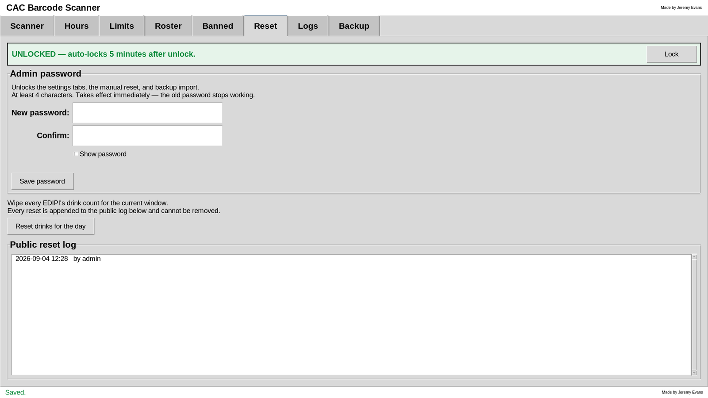

The Reset tab holds two admin jobs: setting the admin password and
wiping the current drink counts. Both need the settings unlocked.

### 10.1 Setting the admin password

The **Admin password** box sits at the top of the tab.

1. Type the new password in **New password**. It must be at least
   **4 characters**. Anything is allowed: letters, numbers, spaces,
   symbols.
2. Type it again in **Confirm**.
3. Click **Save password** or press **Enter** in either field.

Tick **Show password** to see what you are typing in both fields; it
turns itself off again after a successful save so the next person does
not see it.

The line under the fields updates as you type:

| Hint                                            | Meaning                                                   |
| ----------------------------------------------- | --------------------------------------------------------- |
| **Enter a new password.**                       | The first field is empty.                                 |
| **Too short — 2 more characters needed.**       | Keep typing until there are at least 4 characters.        |
| **Type it again in Confirm.**                   | The second field is empty.                                |
| **The two passwords don't match.**              | Fix one of the fields.                                    |
| 🟢 **Ready — click Save password.**             | All good.                                                 |
| 🟢 **Saved. Use the new password from now on.** | Done.                                                     |

The new password takes effect **immediately**. The current unlock
session continues until it locks, but the next unlock needs the new
password. The Logs tab records **admin password changed** without the
password itself, which is never written anywhere in readable form.

> [!WARNING]
> Write the new password down somewhere safe. If it is lost, the only
> way back in is the file edit in
> [Section 5.7](#57-recovering-a-lost-password), which needs Windows
> administrator rights.

### 10.2 Resetting drink counts

**Reset drinks for the day** sets **everyone's** count back to zero
from this moment. Typical uses: a private event that gets its own
allowance, or recovering from a mis-set clock.

1. Unlock the settings.
2. Click **Reset drinks for the day**.
3. A popup asks **Reset every EDIPI's drink count for the current
   window? This cannot be undone.** Click **Yes**.

Immediately afterwards:

- Every person's count is 0 and **Drinks served** shows 0.
- The session line on the Scanner tab gains **• reset at Fri 20:15**.
- The scan records from before the reset are deleted from the PC.
- A line is added to the **Public reset log** and to the Logs tab.

A reset affects only the current counting period. At the next opening
time (or as the rolling window moves on) things carry on as normal.

There is no way to undo a reset or to restore the deleted counts.

### 10.3 The public reset log

The list at the bottom of the tab shows every reset ever performed on
this PC, newest first, as **2026-09-04 20:15 by admin**. The log cannot
be edited or deleted from inside the app and survives session
changeovers, updates, and reinstalls. (Importing a backup replaces it
with the backup's own reset log.) It is the accountability trail
for "who zeroed the counts and when". (Entries from very old versions
may show two ID numbers instead of "admin".)

---

## 11. Logs tab

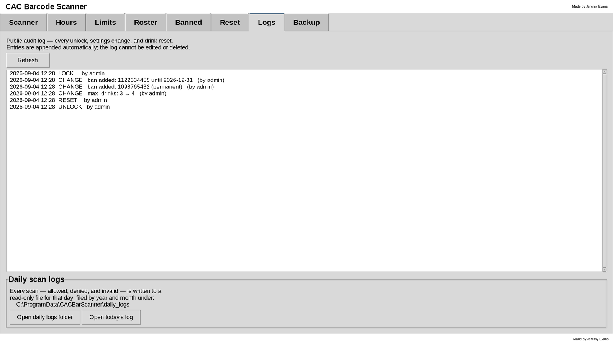

The Logs tab has two parts: the **audit log** list, a read-only history
of every administrative action on this PC, newest first, and below it
the **Daily scan logs** box, which opens the per-day files that record
every single scan. Both are available without the password so anyone
can check them. The audit list reloads itself each time you open the
tab; click **Refresh** to reload while you are looking at it.

### 11.1 What each line means

Every line starts with the date and time, then the action, then the
details.

| Line looks like                                                   | What happened                                                                     |
| ----------------------------------------------------------------- | --------------------------------------------------------------------------------- |
| `2026-09-04 19:58  UNLOCK   by admin`                             | Someone entered the admin password.                                               |
| `2026-09-04 20:01  CHANGE   max_drinks: 3 → 4   (by admin)`       | A setting was changed. The old and new values are shown.                          |
| `2026-09-04 20:01  CHANGE   open_time: 00:00 → 17:00   (by admin)`| Opening time changed.                                                             |
| `2026-09-04 20:01  CHANGE   category disabled: E, O   (by admin)` | Roster boxes were unticked (or `enabled` for ticked).                             |
| `2026-09-04 20:02  CHANGE   ban added: 1234567890 (permanent)   (by admin)` | A ban was added (or `ban removed: …`).                                  |
| `2026-09-04 20:02  CHANGE   admin password changed   (by admin)`  | The password was changed.                                                         |
| `2026-09-04 20:03  LOCK     by admin`                             | Settings were locked, by hand, by the timer, or by closing the app.               |
| `2026-09-04 20:15  RESET    by admin`                             | Drink counts were reset.                                                          |
| `2026-09-04 23:30  EXPORT   cac_scanner_backup_2026-09-04.zip`    | A backup was exported (no password needed, so no "by admin").                     |
| `2026-09-05 09:10  IMPORT   by admin`                             | A backup was imported, replacing settings and logs.                               |

Setting names in CHANGE lines: `tracking_mode`, `rolling_hours`,
`open_time`, `close_time`, `max_drinks`, `category`, `branch`, `ban`.

### 11.2 Things worth knowing

- **CHANGE lines are written when the settings lock**, not at the
  moment of each edit. They describe the net difference between unlock
  and lock. If you change the limit from 3 to 5 and back to 3 in the
  same unlock session, nothing is logged for it.
- The password change is the exception: it is logged the moment it is
  saved.
- Every UNLOCK is logged, including ones where nothing was changed.
- Nobody can edit or delete entries from inside the app. The log lives
  in `C:\ProgramData\CACBarScanner\audit.jsonl` and is never trimmed.
- Individual scans are **not** in this list. They are in the daily
  scan logs, described next.
- Use **Export full backup…** on the Backup tab to keep a long-term
  copy of the audit log off the PC.

### 11.3 Daily scan logs

Every scan, whatever the verdict, is written to a file for that
calendar day the moment it happens. These files are the permanent
record of who was scanned, when, and what the app decided.

**Where they are.** Inside the data folder, filed by year and then
month, one file per day:

    C:\ProgramData\CACBarScanner\daily_logs\
        2026\
            09\
                2026-09-04.csv
                2026-09-05.csv

**Opening them.** At the bottom of the Logs tab:

- **Open daily logs folder** opens the `daily_logs` folder in File
  Explorer. Drill into the year and month folders to reach a day.
- **Open today's log** opens today's file directly in whatever
  program Windows uses for `.csv` files, usually Excel or Notepad. If
  nothing has been scanned yet today, the status bar says so.

**What each row holds.** The files are plain CSV, so they open in
Excel as a spreadsheet with these columns:

| Column                       | Example                                  | Meaning                                                                                  |
| ---------------------------- | ---------------------------------------- | ---------------------------------------------------------------------------------------- |
| **Time**                     | `2026-09-04 20:15:32`                    | Local date and time of the scan.                                                         |
| **EDIPI**                    | `1234567890`                             | The card's DoD ID. Blank for an invalid scan.                                            |
| **Category**                 | `A - Active duty member`                 | Category letter and meaning.                                                             |
| **Branch**                   | `N - USN (Navy)`                         | Branch letter and meaning.                                                               |
| **Verdict**                  | `ALLOWED`, `DENIED`, or `INVALID`        | What the banner showed.                                                                  |
| **Detail**                   | `2nd drink` / `You've had 3 drinks today (limit 3)` | The banner's detail line: the drink number, or the denial reason, or what was wrong with an invalid read. |
| **Drinks**                   | `2 / 3`                                  | The count and limit the banner showed at that moment.                                    |
| **Scans today (this card)**  | `4`                                      | How many times this card has been scanned today, counting this scan and counting denied scans too. |

The last column is the quick way to spot someone who keeps trying: a
card with `Scans today` climbing while the verdict stays `DENIED`.

**They are view-only.** Each file is marked read-only the instant a
row is written, so a program that opens it can look but cannot save
changes over it. Excel will offer to save a *copy* if you edit; the
original stays as the app wrote it. The app itself never edits or
deletes these files, and they are not trimmed the way the drink
counts are.

> [!NOTE]
> The files follow the **calendar day**. A session that crosses
> midnight is split across two files, with the after-midnight scans in
> the next day's file. The `Scans today` column also restarts at
> midnight.

> [!IMPORTANT]
> Daily scan logs are **not** included in the Backup tab's `.zip`,
> which covers settings and the admin logs only. To keep copies off
> the PC, copy the `daily_logs` folder from File Explorer. They contain
> DoD ID numbers, so treat copies as sensitive.

---

## 12. Backup tab

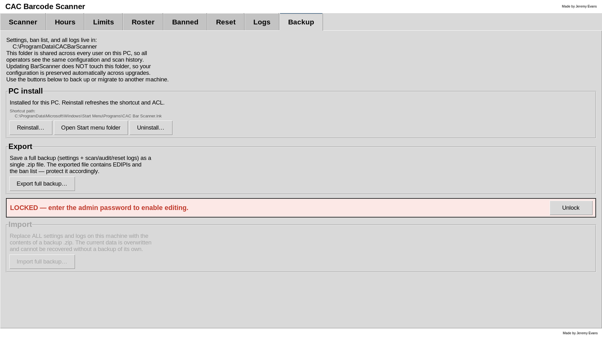

The Backup tab is where you copy the app's data out, bring it back in,
and manage the PC install.

### 12.1 The data folder

The text at the top reminds you where everything lives:
`C:\ProgramData\CACBarScanner\` on Windows. That folder is shared by
every Windows account on the PC and is never touched when the app is
updated. See [Part 14](#14-where-data-is-stored-and-privacy) for what
is in it.

### 12.2 PC install box

Covered in [Section 2.7](#27-reinstall-or-repair-from-inside-the-app).
Shown only in the Windows program.

### 12.3 Exporting a backup

No password needed.

1. Click **Export full backup…**
2. A normal Windows save dialog opens with a suggested name such as
   `cac_scanner_backup_2026-09-04.zip`. Choose where to save it (a USB
   stick or a network folder is a good idea) and click **Save**.
3. The status bar confirms **Exported to …** and an EXPORT line is
   added to the Logs tab.

The `.zip` contains:

| File                    | Contents                                                       |
| ----------------------- | -------------------------------------------------------------- |
| `settings.json`         | Hours, limit, roster, ban list, and the admin password (hashed).|
| `scans.jsonl`           | Drink records for the current counting period.                 |
| `audit.jsonl`           | The full Logs tab history.                                     |
| `resets.jsonl`          | The full public reset log.                                     |
| `backup_manifest.json`  | The backup format version and the time it was made.            |

The daily scan logs are **not** in the `.zip`. Copy the `daily_logs`
folder by hand if you want them backed up too (see
[Section 11.3](#113-daily-scan-logs)).

> [!WARNING]
> The backup contains DoD ID numbers and the ban list. Treat the file
> as sensitive: keep it somewhere staff cannot casually open, and do
> not email it around.

### 12.4 Importing a backup

Import **replaces everything** on this PC with the contents of the
backup. It needs the settings unlocked.

1. Unlock the settings (the pink banner above the Import box).
2. Click **Import full backup…** and choose the `.zip`.
3. A popup shows the file name and asks you to confirm. Click **Yes**.
4. The status bar says **Imported cac_scanner_backup_….zip** and every
   tab updates to the imported settings.

What to expect:

- The app checks the whole file before touching anything. If the file
  is not a valid backup, the status bar shows **Import failed: …** and
  your current data is left exactly as it was.
- The imported settings include the **admin password** from the other
  machine. After importing a backup made elsewhere, unlock with *that*
  machine's password (or `admin` if it never set one). You stay
  unlocked for the rest of the current session.
- The Logs tab history is replaced by the backup's history, with an
  **IMPORT** line added at the end so the import itself is on record.
- Drink counts from the backup are only kept if they fall within the
  current counting period; older ones are trimmed away immediately.
- There is no undo. If you might want the current data back, export it
  first.

### 12.5 Moving to a new PC

1. On the old PC: **Backup → Export full backup…** to a USB stick.
2. On the new PC: install the app ([Part 2](#2-installing-on-a-windows-pc)).
3. On the new PC: unlock with `admin`, then **Backup → Import full
   backup…** from the USB stick.
4. The new PC now has the old PC's password, hours, limit, roster,
   bans, and logs.

### 12.6 A simple backup routine

Export once a month, or after any change to the roster or ban list,
and keep the last few files. The export takes seconds and needs no
password, so it can be part of a closing checklist.

---

## 13. How decisions and counting work

This part explains the rules precisely, for managers who want to
predict exactly what the app will do.

### 13.1 The decision order

For every valid scan the app runs down this list and stops at the
first rule that fails. The reason shown on the DENIED banner is that
rule's message.

| Order | Check                                                          | Denial message                                  |
| ----- | -------------------------------------------------------------- | ----------------------------------------------- |
| 1     | Is the EDIPI on the ban list with an active ban?               | This DoD ID is permanently banned / banned until… |
| 2     | Is the bar open right now? (operating-hours mode only)         | Bar is closed (outside operating hours)         |
| 3     | Is the category ticked on the Roster tab?                      | *Category* (X) not allowed                      |
| 4     | Is the branch ticked on the Roster tab?                        | *Branch* (X) not allowed                        |
| 5     | Is the person's count below the limit?                         | You've had N drinks today (limit L)             |

If all five pass the scan is **ALLOWED**, the drink is recorded, and
the count shown is the old count plus one.

### 13.2 The counting period

A person's count is the number of allowed scans of their EDIPI since
the **effective start**, which is the later of:

- the start of the current period: the most recent Open time in
  operating-hours mode, or "now minus N hours" in rolling-window mode;
  and
- the most recent **Reset drinks for the day**, if there has been one
  in this period.

Everything before the effective start is ignored. The session line on
the Scanner tab shows both the period start and, if there was one, the
reset time, so you can always see what is being counted.

### 13.3 What counts

- Only **ALLOWED** scans are recorded.
- DENIED and INVALID scans are never recorded, so they can never push
  someone closer to the limit.
- Counts are per EDIPI. Two people with different cards are counted
  separately; the same card scanned twice is the same person.
- Scanning is the only way a drink gets counted. There is no manual
  "add a drink" or "remove a drink".

### 13.4 How long drink records are kept

The app keeps drink records only for the **current counting period**.
Once a minute, and after every allowed scan, it deletes any record
older than the effective start:

- In operating-hours mode, when the bar closes, **all** drink records
  are deleted within a minute. When it next opens everyone is at zero.
- In rolling-window mode, records older than N hours are deleted as
  they age out.
- After a reset, the records from before the reset are deleted.

This trimming applies only to the drink-count records the limit is
calculated from. The **daily scan logs** are separate: every scan is
written there permanently and the app never deletes them (see
[Section 11.3](#113-daily-scan-logs)). The audit log and reset log are
likewise kept forever.

### 13.5 Time and the PC clock

All times are taken from the PC's clock and time zone. Records are
stored in universal time and shown in local time, so a clock-change
weekend does not double-count or lose drinks, but a **wrong** clock
will open and close the bar at the wrong times. Check the Windows
clock as part of setup.

### 13.6 One PC, one set of counts

Each PC keeps its own counts. Two scanners on two PCs do not share
anything, so a person could be served the limit at each. If you need
more than one scanning station, use one PC with a long USB cable or a
second scanner plugged into the same PC.

---

## 14. Where data is stored and privacy

Everything the app saves lives in one folder:

| Platform                               | Folder                                              |
| -------------------------------------- | --------------------------------------------------- |
| Windows                                | `C:\ProgramData\CACBarScanner\`                     |
| Linux or macOS (run from source)       | `~/.cac_scanner/`                                   |

On Windows the folder is the same whether or not the app was installed
for the PC. Installing is what gives every Windows account permission
to write to it.

| File             | What's in it                                                            | Kept for                             |
| ---------------- | ----------------------------------------------------------------------- | ------------------------------------ |
| `settings.json`  | Hours, limit, roster, ban list, tracking mode, and the admin password hash. | Until changed.                    |
| `scans.jsonl`    | One line per allowed drink: EDIPI and timestamp.                        | The current counting period only.    |
| `audit.jsonl`    | Every unlock, lock, change, export, and import (the Logs tab).          | Forever.                             |
| `resets.jsonl`   | Every drink reset (the public reset log).                               | Forever.                             |
| `daily_logs\`    | One read-only CSV per day with every scan, in `year\month\` folders.   | Forever, until you delete them.      |

Privacy points:

- The only personal data stored is the **DoD ID number** plus category
  and branch letters. No names, no photos, no card expiry dates. The
  daily scan logs keep those IDs permanently; everything else is
  trimmed to the current counting period.
- The admin password is stored as a salted **PBKDF2-SHA256 hash**. It
  cannot be read back out of the file.
- The app **never uses the network**. It makes no connections and
  sends nothing anywhere.
- The data folder is readable and writable by **every Windows account
  on the PC**. That is what lets different bartender logins share the
  same counts. If that is a concern, use one shared Windows account for
  the bar.
- Backups (`.zip`) contain the same files, so handle them with the same
  care.

You never need to open these files by hand. The one exception is the
password recovery in [Section 5.7](#57-recovering-a-lost-password).

---

## 15. Troubleshooting

### Scanning problems

| Problem                                                          | Likely cause and fix                                                                                                                                           |
| ---------------------------------------------------------------- | -------------------------------------------------------------------------------------------------------------------------------------------------------------- |
| Scanner beeps but nothing changes on screen                      | The cursor is not in the input box. Click anywhere on the Scanner tab and scan again. Also check you are on the **Scanner** tab, not an admin tab.            |
| Barcode characters show up in another program or in a settings field | Same cause. Close or ignore the other program, click the Scanner tab, scan again. Delete any stray characters from a settings field.                       |
| **INVALID SCAN … expected 18 characters, got 17** (or 19, etc.)  | A partial or double read. Scan again, holding the card still. If it happens with every card, the scanner may be adding or dropping characters; see the next rows. |
| Several **INVALID SCAN** banners in a row from one pull of the trigger | The scanner is reading the 2D barcode, which is far longer than 18 characters. Aim at the linear stripe, or configure the scanner to read only Code 39.   |
| **INVALID SCAN … is not valid base-32**                          | The read was garbled or the scanner is in the wrong keyboard layout. Set the scanner to "US keyboard" mode in its manual, then scan again.                     |
| Scans work but the cursor jumps away after each one              | The scanner is sending a **Tab** after the code. Configure it to send **Enter** or nothing instead.                                                            |
| Scan shows **Unknown** category or branch                        | A card with a code the app does not know. It is denied by the roster check. This is expected for unusual cards.                                                |
| No sound                                                         | Check the Windows volume and that speakers are connected. The app has no mute. If the PC has no sound device it is simply silent.                              |

### Counting problems

| Problem                                                          | Likely cause and fix                                                                                                                                   |
| ---------------------------------------------------------------- | ------------------------------------------------------------------------------------------------------------------------------------------------------ |
| Session line says **CLOSED right now** but the bar is open       | The Hours tab times are wrong, or the PC clock is wrong. Fix whichever it is. Remember Close earlier than Open means crossing midnight.                |
| Everyone was reset to zero unexpectedly                          | The bar passed its Open time (counts restart), or someone used **Reset drinks for the day** (check the Logs tab), or the Open time was edited during service. |
| A person's count seems too high                                  | The same card was scanned more than once per drink. Each green scan is one drink. There is no way to remove a drink except a full reset.                |
| A person is allowed when they should be over the limit           | The counting period rolled over, or the limit was raised. Check the session line and the Logs tab.                                                     |
| A ban does not deny                                              | Check the EDIPI on the ban matches the EDIPI in the Decoded box digit for digit, and that the ban has not expired (shown as **(EXPIRED)** in the list). |

### Admin and settings problems

| Problem                                                          | Likely cause and fix                                                                                                                       |
| ---------------------------------------------------------------- | ------------------------------------------------------------------------------------------------------------------------------------------ |
| All the controls on a tab are grey                               | The settings are locked. Click **Unlock** on the pink banner.                                                                              |
| **Incorrect password.**                                          | Check Caps Lock. If the password was changed and nobody knows it, see [Section 5.7](#57-recovering-a-lost-password).                      |
| Controls went grey while I was editing                           | The five-minute auto-lock. Your changes so far are saved. Unlock again.                                                                    |
| Red **Invalid time** in the status bar                           | An Hours field is incomplete or malformed. Use 24-hour `HH:MM`, e.g. `17:00`.                                                              |
| **Rolling hours must be between 1 and 168**                      | Type a number in that range.                                                                                                               |
| **Import failed: …**                                             | The file is not a backup made by this app, or is damaged. Nothing was changed. Try a different backup file.                                |
| After importing a backup my password no longer works             | The backup brought its own password. Use the password from the PC where the backup was made, or `admin` if it never had one.               |
| **Open today's log** says no scans have been logged yet          | Nothing has been scanned since midnight. Use **Open daily logs folder** to reach earlier days.                                             |
| Red **Daily log not written** in the status bar                  | The day's file could not be appended: the disk is full, or someone cleared its read-only flag and is holding it open. The scan itself still counted. Close the file and scan again. |
| Excel refuses to save changes to a daily log                     | Expected. The files are read-only on purpose. Save a copy under another name if you need to edit.                                          |

### Install and Windows problems

| Problem                                                          | Likely cause and fix                                                                                                                                      |
| ---------------------------------------------------------------- | --------------------------------------------------------------------------------------------------------------------------------------------------------- |
| **Windows protected your PC** on launch                          | Click **More info → Run anyway**. The program is not code-signed, which is all this warning means.                                                        |
| Install prompt never appeared                                    | Someone already installed it, or clicked **Not now** on this account. Use **Backup → PC install** to install or check the state.                          |
| Typing "Bar" in the Start menu finds nothing                     | Windows Search has not indexed the new shortcut yet. Wait a minute. Or **Backup → Open Start menu folder** and double-click the shortcut there.           |
| **Install failed at: …** popup                                   | Note the step named. Right-click `BarScanner.exe` → **Run as administrator** and try again. See [Section 2.8](#28-if-the-install-fails).                  |
| Two copies of the app are open                                   | Close one with **Ctrl + Q**. Both read the same data folder, so nothing is lost, but only scan on one.                                                    |
| The window is small or not fullscreen                            | Press **F11**. The app opens maximized on Windows; F11 removes the title bar as well.                                                                     |
| Program Files folder still there after uninstall                 | It is deleted on the next reboot. Restart the PC.                                                                                                         |
| Settings or scans do not save when a different Windows account is logged in | The app was run without installing, so the data folder belongs to one account. Install for the PC from **Backup → PC install**, which fixes the folder permissions. |

---

## 16. Keyboard shortcuts

| Key            | Where             | What it does                                                        |
| -------------- | ----------------- | ------------------------------------------------------------------- |
| **F11**        | Anywhere          | Toggle fullscreen (kiosk mode)                                      |
| **Esc**        | Anywhere          | Leave fullscreen (back to a maximized window)                       |
| **Ctrl + Q**   | Anywhere          | Quit the app (locks settings first)                                 |
| **Enter**      | Scanner input box | Process whatever is typed (scanners normally do this for you)        |
| **Enter**      | Unlock popup      | Submit the password                                                 |
| **Enter**      | Banned tab fields | Add the ban                                                         |
| **Enter**      | Password fields   | Save the new password                                               |
| **Esc**        | Install prompt    | Same as **Not now**                                                 |

---

## 17. Quick reference card

Print this page and keep it by the kiosk.

**Start:** Windows key → type `Bar` → Enter. **F11** for fullscreen.

**Scan:** aim at the linear barcode on the **front** of the CAC. No
button to press.

| Screen                     | Sound   | Do this                                                 |
| -------------------------- | ------- | ------------------------------------------------------- |
| 🟢 **ALLOWED — 2nd drink** | Bell    | Serve. The big number is this drink's number.           |
| 🔴 **DENIED**              | Buzzer  | Don't serve. Read the reason under the number.          |
| 🔴 **INVALID SCAN**        | Buzzer  | Scan again, holding the card still.                     |

**If a scan does nothing:** click anywhere on the Scanner tab, scan again.

**Denied reasons:** banned · bar closed · category not allowed ·
branch not allowed · limit reached.

**Admin (needs password):** click **Unlock** on the pink banner.
Auto-locks after 5 minutes. Every change saves instantly.

| Want to…                       | Go to…                                             |
| ------------------------------ | -------------------------------------------------- |
| Change opening hours           | **Hours** tab                                      |
| Change the drink limit         | **Limits** tab                                     |
| Allow or block a whole group   | **Roster** tab                                     |
| Ban one person                 | **Banned** tab (EDIPI is in the Decoded box)       |
| Zero everyone's count now      | **Reset** tab → **Reset drinks for the day**       |
| Change the admin password      | **Reset** tab → **Admin password**                 |
| See who changed what           | **Logs** tab                                       |
| See every scan from today      | **Logs** tab → **Open today's log**                |
| Back up or move to another PC  | **Backup** tab                                     |

**Quit:** **Ctrl + Q**. Nothing is lost.

---

## 18. Glossary

| Term                   | Meaning                                                                                                   |
| ---------------------- | --------------------------------------------------------------------------------------------------------- |
| **CAC**                | Common Access Card, the DoD smart ID card. The app reads the linear barcode on its front.                |
| **EDIPI**              | Electronic Data Interchange Personal Identifier: the 10-digit DoD ID number. Also called "DoD ID".        |
| **PCC**                | Personnel Category Code, the single letter that says what kind of cardholder someone is (active duty, retiree, contractor…). |
| **Branch**             | The service the cardholder belongs to (Army, Navy, Air Force…).                                           |
| **Code 39**            | The type of linear barcode printed on the front of a CAC.                                                 |
| **Session**            | In operating-hours mode, one Open-to-Close period. Counts start over each session.                        |
| **Rolling window**     | A counting period of "the last N hours", measured back from each scan.                                    |
| **Effective start**    | The moment counting begins: the later of the period start and the last reset.                             |
| **Verdict**            | The app's decision for a scan: ALLOWED, DENIED, or INVALID SCAN.                                          |
| **Lock / Unlock**      | Whether the admin tabs can be edited. Unlocking needs the admin password and lasts 5 minutes.             |
| **Reset**              | Zeroing everyone's drink count from this moment, from the Reset tab.                                      |
| **Audit log**          | The Logs tab: a permanent record of admin actions.                                                        |
| **Public reset log**   | The list on the Reset tab: a permanent record of every reset.                                             |
| **Daily scan log**     | The read-only CSV file for one calendar day listing every scan, opened from the Logs tab.                 |
| **UAC**                | User Account Control, the blue Windows prompt asking permission for an administrator action.              |
| **SmartScreen**        | The Windows feature behind the "Windows protected your PC" warning for unsigned programs.                 |
| **Keyboard wedge / HID mode** | A barcode scanner mode where the scanner behaves like a keyboard, typing what it reads.            |
| **Data folder**        | `C:\ProgramData\CACBarScanner\`, where all settings and logs are kept.                                    |
